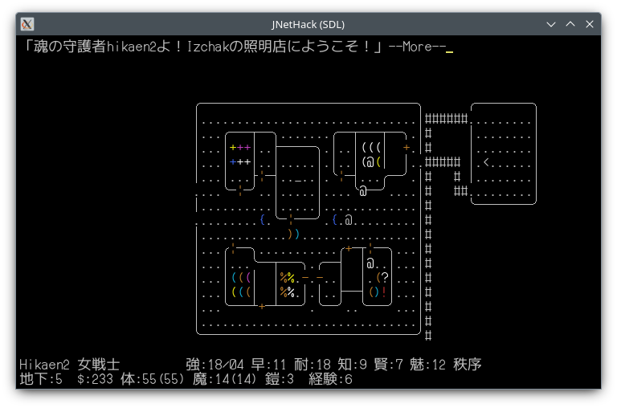

# JNetHack 3.4.3 SDL

JNetHack 3.4.3-0.11のSDLポーティングです。
LinuxとWindowsで動きます。



## Linux

必要なもの: GCC / SDL2 / SDL2_ttf / flex / bison

```sh
./test/build.sh sdl
./test/mkplaydir.sh ~/jnhdir
HACKDIR=~/jnhdir ./src/jnethack.sdl
```

## Windows

https://github.com/hikaen2/jnethack-sdl/releases
からjnethack-3.4.3-0.11-sdl-win64.zipをダウンロードしてください。
